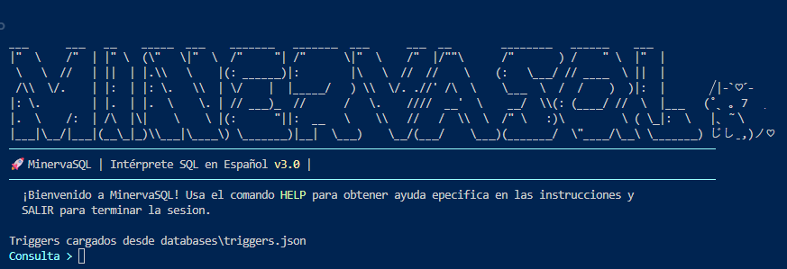
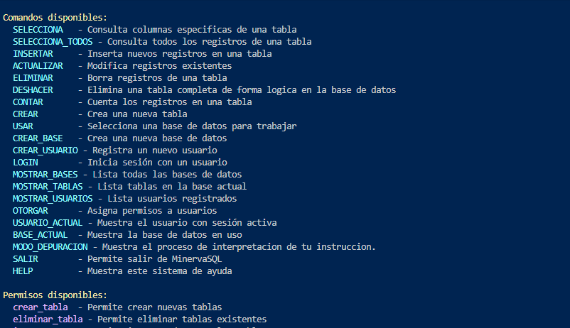
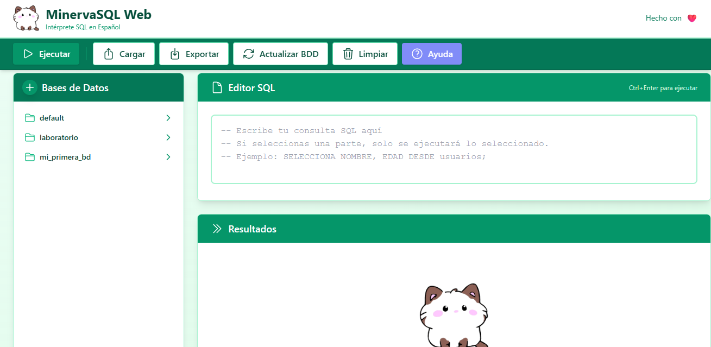
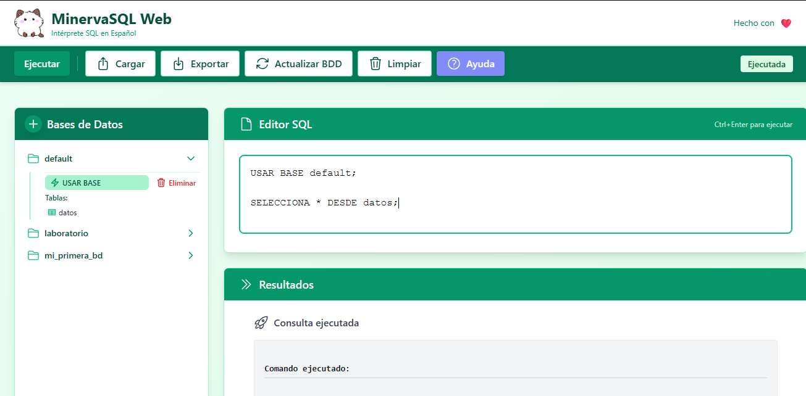
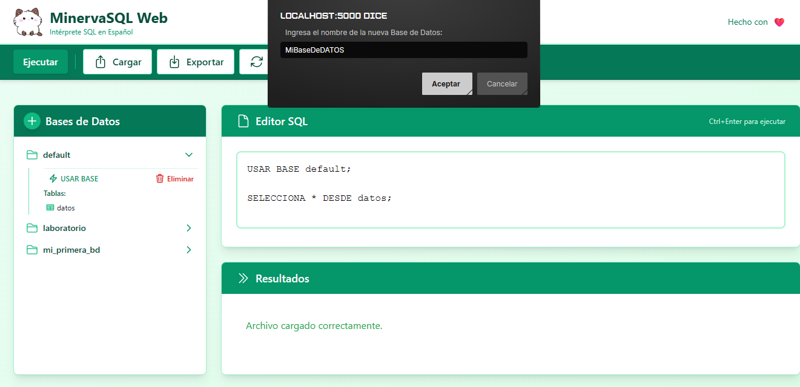
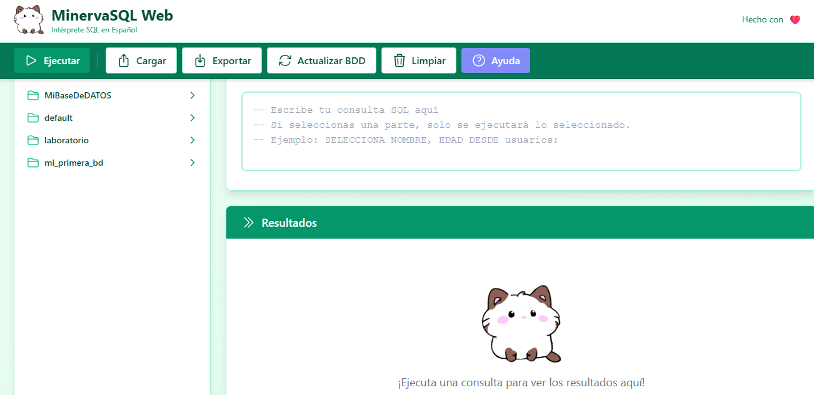
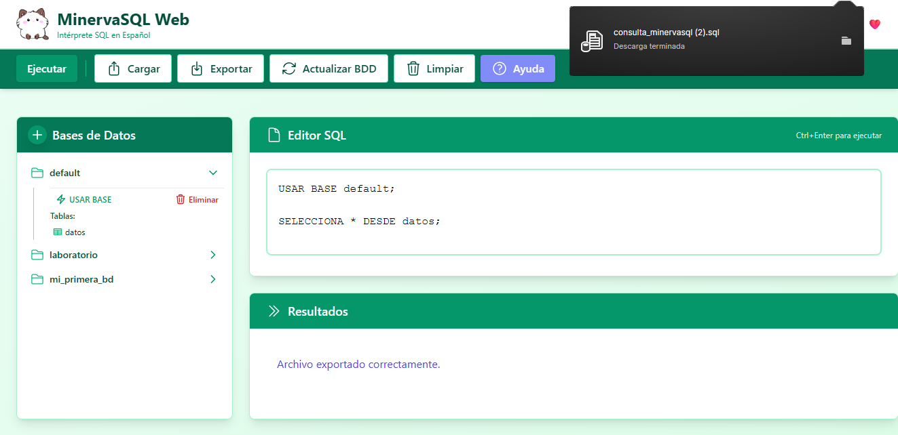
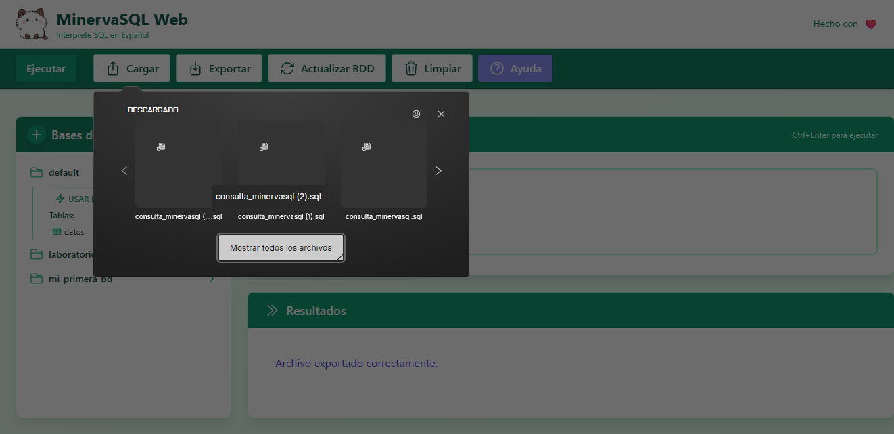
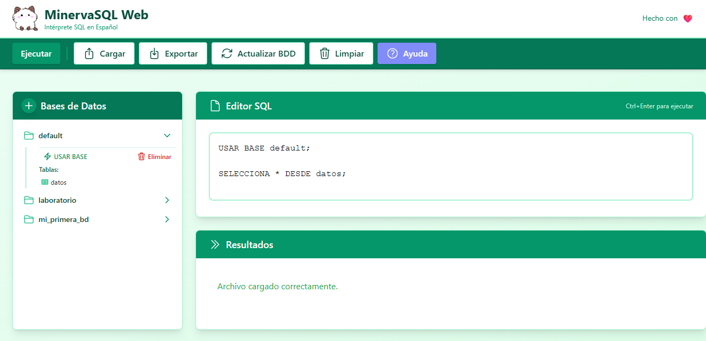

# Intérprete SQL ESPAÑOL

```
  ___      ___   __    _____  ___    _______  
 |"  \    /"  | |" \  (\"   \|"  \  /"     "| 
  \   \  //   | ||  | |.\\   \    |(: ______) 
  /\\  \/.    | |:  | |: \.   \\  | \/    |          へ♡ ╱|-`♡´-   
 |: \.        | |.  | |.  \    \. | // ___)_    ૮  >  <) (˚ˎ 。7  ִ ࣪𖤐
 |.  \    /:  | /\  |\|    \    \ |(:      "|   /  ⁻  ៸|  |、˜〵   
 |___|\__/|___|(__\_|_)\___|\____\) \_______) 乀(ˍ, ل ل  じしˍ,)ノ⁠♡
 
 MinervaSQL - Intérprete SQL en Español v1.0
```

## 🚀 Cómo Ejecutarlo
```sh
python main.py
```
<p align="center">
  
</p>

## Control de Transacciones

El **control de transacciones** te permite agrupar una serie de operaciones de base de datos en una única unidad de trabajo.  
Esto asegura que todas las operaciones se completen con éxito o, si ocurre algún error, que ninguna de ellas se aplique, manteniendo la integridad de tus datos.

---

## Flujo de transacciones en el código

El comando **BEGIN** marca el inicio de una nueva transacción.  
Desde este punto, todas las operaciones de modificación de datos (`INSERTAR`, `ACTUALIZAR`, `ELIMINAR`) se registran temporalmente.

### Ejemplo:
```sql
BEGIN;

## Secuencias Actuales
Éstas son las instrucciones reconocidas por el motor (ejemplos que pueden copiarse y probarse, no estrictamente la estructura lógica de las instrucciones, ésta se encuentra en HELP)

SELECCIONA HR, TEMP DESDE datos;
```
Una vez iniciada la transacción esta puede completarse o deshacerse. 

### Ejemplo Rollback:
Rollback esta pensado para cancelar el conjunto de transacciones que se pretendían realizar, para MinervaSQL el siguiente bloque de código sería respondido con un __transaccion cancelada__.
```sql
BEGIN;
    SELECCIONA HR, TEMP DESDE datos;
ROLLBACK
```
### Ejemplo COMMIT:
Commit esta pensado para confirmar y realizar el conjunto de transacciones, para MinervaSQL el siguiente bloque de código sería respondido con un __transaccion completada__.
```sql
BEGIN;
    USAR BASE paciente;
    SELECCIONA HR, TEMP DESDE datos;
COMMIT
```
Algunas de las ventajas de el manejo de flujo en MinervaSQL son:
* Hace que sea mas sencillo el manejo de múltiples instrucciones.
* Prueden realizarse instrucciones que se requieren en conjunto (ej. al momento de sleccionar datos de una tabla es necesario estar usando la base a la que pertenece).
* Puede exportarse y usarse como un bloque recurrente.

## Instrucciones soportadas por el gestor 
```sql
SELECCIONA * DESDE pacientes
```

```sql
INSERTAR EN pacientes (ID, ID_SALA, NOMBRE, EDAD) VALORES (1, 2, 'Karla 4', 4000);
```
```sql
SELECCIONA NOMBRE, EDAD DESDE pacientes DONDE ID_SALA = 2 ORDENAR POR EDAD ASC;
```
```sql
SELECCIONA NOMBRE, EDAD DESDE pacientes DONDE ID_SALA = 2 ORDENAR POR EDAD DESC;
```
```sql
ACTUALIZAR pacientes CON NOMBRE = 'Karla Vazquez' DONDE EDAD = 20;
```
```sql
BORRAR DE datos DONDE HR EQ 90;
```
```sql
DESHACER pacientes;
```
```sql
CONTAR DESDE pacientes;
```
```sql
CREAR TABLA pacientes (ID, ID_SALA NOMBRE, EDAD);
```
```sql
USAR BASE datos;
```
```sql
CREAR BASE laboratorio;
```
```sql
CREAR USUARIO fernando PARA 1234
```
```sql
LOGIN fernando PARA 1234
```
```sql
ELIMINAR USUARIO fernando
```
```sql
MOSTRAR BASES
```
```sql
MOSTRAR TABLAS
```
```sql
MOSTRAR USUARIOS
```
```sql
USUARIO_ACTUAL;
```
```sql
ELIMINAR BASE oficina;
```
```sql
BASE_ACTUAL;
```
```sql
HELP
```
```sql
SALIR
```
```sql
MODO DEPURACION
```
## Permisos
```sql
OTORGAR ver_bases A fernando;
```
```sql
OTORGAR otorgar A fernando;
```
```sql
OTORGAR ver_tablas A fernando;
```
```sql
OTORGAR insertar A fernando;
```
```sql
OTORGAR usar_base A fernando;
```
```sql
OTORGAR ver_usuarios A fernando;
```
```sql
OTORGAR crear_base A fernando;
```
```sql
OTORGAR actualizar A fernando;
```
```sql
OTORGAR contar A fernando;
```
```sql
OTORGAR eliminar A fernando;
```
```sql
OTORGAR crear_tabla A fernando;
```
```sql
OTORGAR eliminar_tabla A fernando;
```
### Retirar los permisos
```sql
REVOCAR ver_bases A fernando;
```
```sql
REVOCAR otorgar A fernando;
```
```sql
REVOCAR ver_tablas A fernando;
```
```sql
REVOCAR insertar A fernando;
```
```sql
REVOCAR usar_base A fernando;
```
```sql
REVOCAR ver_usuarios A fernando;
```
```sql
REVOCAR crear_base A fernando;
```
```sql
REVOCAR actualizar A fernando;
```
```sql
REVOCAR contar A fernando;
```
```sql
REVOCAR eliminar A fernando;
```
```sql
REVOCAR crear_tabla A fernando;
```
```sql
REVOCAR eliminar_tabla A fernando;
```
```sql
REVOCAR crear_tabla A karla;
```
```sql
REVOCAR ver_bases A karla;
```
## Explicación

La siguiente tabla da una breve decripción de los permisos que se pueden asignar a los usuarios.
| Permiso | Descripción |
|---------|-------------|
| ver_bases | Listar todas las bases de datos |
| otorgar | Asignar permisos a usuarios |
| ver_tablas | Mostrar tablas de una base |
| insertar | Añadir nuevos registros |
| usar_base | Seleccionar una base para trabajar |
| ver_usuarios | Listar usuarios existentes |
| crear_base | Crear nuevas bases de datos |
| actualizar | Modificar registros existentes |
| contar | Obtener cantidad de registros |
| eliminar | Borrar registros |
| crear_tabla | Crear nuevas tablas |
| eliminar_tabla | Eliminar tablas existentes |

## Léxico Actual
```python
TOKEN_PATTERNS = [
    (r'\bSELECCIONA\b', 'SELECCIONA'),
    (r'\bBORRAR\b', 'ELIMINAR'),
    (r'\bDESDE\b', 'DESDE'),
    (r'\bDONDE\b', 'DONDE'),
    (r'\bINSERTAR\b', 'INSERT'),
    (r'\bEN\b', 'INTO'),  
    (r'\bUSUARIO_ACTUAL\b', 'CURRENT_USER'),
    (r'\bBASE_ACTUAL\b', 'CURRENT_DATABASE'),
    (r'\bVALORES\b', 'VALUES'),  
    (r'\bUSAR\b', 'USE'),
    (r'\bBASE\b', 'DATABASE'),
    (r'\bBASES\b', 'DATABASES'),
    (r'\bMOSTRAR\b', 'SHOW'),
    (r'\bOTORGAR\b', 'GRANT'),
    (r'\bA\b', 'TO'),
    (r'\bMOSTRAR\b', 'MOSTRAR'),
    (r'\bTABLAS\b', 'TABLES'),
    (r'\bUSUARIO\b', 'USER'),
    (r'\bPARA\b', 'WITH'),
    (r'\bCREAR\b', 'CREATE'),
    (r'\bLOGIN\b', 'LOGIN'),
    (r'\bUSUARIO\b', 'USUARIO'),
    (r'\bUSUARIOS\b', 'USUARIOS'),
    (r'\bACTUALIZAR\b', 'ACTUALIZAR'),  
    (r'\bCREAR\b', 'CREATE'),
    (r'\bCON\b', 'SET'),
    (r'\bTABLA\b', 'TABLE'),
    (r'\bDESHACER\b', 'DESHACER'),
    (r'\bELIMINAR\b', 'DELETE'),
    (r'\bDE\b', 'FROM'),
    (r'\bCONTAR\b', 'COUNT'),
    (r'\bREVOCAR\b', 'REVOKE'),
    (r'\bTRIGGERS\b', 'TRIGGERS'),
    (r'\bTRIGGER\b', 'TRIGGER'),
    (r'\bORDENAR\b', 'ORDENAR'),
    (r'\bPOR\b', 'POR'),
    (r'\bASC\b', 'ASC'),
    (r'\bDESC\b', 'DESC'),
    (r'\bEQ\b', '='),
    (r'[a-zA-Z_][a-zA-Z0-9_]*', 'IDENTIFIER'),
    (r'\d+\.\d+', 'FLOAT'),
    (r'\d+', 'NUMBER'),
    (r"\*", "ASTERISK"),
    (r'>', 'GT'),
    (r'<', 'LT'),
    (r'=', 'EQ'),
    (r',', 'COMMA'),
    (r';', 'SEMICOLON'),
    (r'\(', 'PARIZQ'),
    (r'\)', 'PARDER'),
    (r'(".*?"|\'.*?\')', 'STRING'),
    (r'\s+', None) 
]

```
## A considerar
Interprete basado en SQL Español.
Algunas reglas y aspectos relevantes:

- Las consultas como promedio, suma, entre otras, se realizan por medio de codigo externo.
- Los tipos de datos en insersion son de tipo FLOAT, INT y STRING.
- La eliminacion de usuarios se maneja desde el archivo de control.
- Los archivos de base de datos estan en la carpeta **database**.
- Los archivos de base de datos se generan con extensión JSON.
- El gestor tiene su propio motor de depuración.
- El usuario root no se puede borrar.
- El usuario root se carga con el primer inicio de sesion, después pueden crearse usuarios loguearse.
- El usuario root es administrador y tiene todos los permisos disponibles.
- El ";"es opcional en la mayoria de instrucciones, solo necesario cuando hay una instruccioque tiene - la ntencion de perdurar.
- El motor es sensible a mayusculas y minusculas.
- Todas las palabras reservadas se escribiran en mayusculas.
- El modo de depuración se activa y desactiva con la misma instrucción (MODO DEPURACION)
- El modo de depuración explica en texto plano el debbugin.
- No pueden revocarse permisos, seria neceario modificarlos desde JSON
- MinervaSQL es un gestor SQL de escritorio, por lo que la interfaz gráfica *NO ESTA DISEÑADA PARA DISPOSITIVOS MÓVILES* no se recomienda usarla en resoluciones menores a 800 x 644 px
- La interfaz GUI hace uso del puerto 5000

## Interfaz de consola
EL programa es amigable para Windows y Linux, la interfaz de consola es capaz de servir todos los comandos antes vistos, se ejecuta directamente como se ve en la imagen de referencia.

### Presentación de la interfaz MinervaSQL


Se observa el uso de uno de los comandos en consola:


## Interfaz GUI
La interfaz GUI contiene un navbar en donde es posible `ejecutar` el código ingresado, `cargar` y `exportar` archivos de extensión sql, `actualizar` el estado de las base de datos (después de adiciones o eliminaciones) `limpiar` el editor y un boton de `ayuda`, ademas de la posibilidad en el panel izquierdo de `crear bases de datos`, `usar bases de datos` y `eliminar` las mismas.



La interfaz maneja el método de inyección de código en la consola, de esta manera el usuario podrá ver cual es el código que está detrás de todas las peticiones que realiza por medio de la GUI.

### Uso del dasboard de la GUI
En la parte izquierda se ubica un panel demostrativo de las bases de datos contenidas, además de acciones rápidas sugeridas. En las siguientes imagenes se aprecia como se puede hacer uso de `USAR BASE` y `SELECCIONA * DESDE datos`, código que se inyecta al hacer clic sobre la base de datos y su tabla, respectivamente.



### Crear Bases de datos 
En el panel izquierdo, botón de suma "+" es posible agregar bases de datos de manera visual, haciendo clic sobre este, seleccionando el nombre y recargando la interfaz, en cuanto se actualice se reflejará en el panel.





### Presentación de la interfaz MinervaSQL
Para exportar archivos de Minerva con extensión sql es necesario escribir el código en el editor y usar el botón de `exportar`, esta acción descargará el archivo directamente.



Si previamente se tiene un archivo y se desea cargarlo, se hará clic en el botón para cargar y se seleccionará dicho archivo, el contenido aparecerá directamente en la sección de edición.




## Respaldos cifrados SSH 
El proceso para crear respaldos de las bases de datos es el siguiente:

Para usar el respaldo por medio de ssh es necesario establecer una clave para ejecutar los scripts. Dicha clave se generará con el uso del siguiente comando:

```sh
ssh-keygen -t rsa -b 4096 -C "usuario@ip_usuario"
```
Tanto la ruta como la passphrase se recomienda dejar en default. Despues de creada la llave, se copia al servidor. Si se tiene un puerto diferente del 22, debe especificarse con -p y ser el mismo que el servidor escucha.
```sh
ssh-copy-id -p 5000 servidor@ip_servidor
```
Para comenzar con el uso de los comandos, deben darse permisos de ejecucion **como comando** a los scripts dentro de la carpeta ssh-backup.

```sh
chmod +x ssh-backups/descargar_respaldo.sh
```
```sh
chmod +x ssh-backups/enviar_bases.sh
```
```sh
chmod +x ssh-backups/restaurar_base.sh
```
### Comandos para el BACKUP
Para realizar una copia de seguridad de todas las bases de datos comprimida y encriptada en el servidor :
```sh
./ssh-backups/enviar_bases.sh servidor /home/servidor/backups
```

Para realizar una copia de seguridad de una base de datos especifica comprimida y encriptada en el servidor.
```sh
./ssh-backups/enviar_bases.sh servidor /home/servidor/backups "" "" "" nombre_base
```

En caso de querer descargar (no restaura inmediatamente, unicamente descarga) una base de datos desde el servidor a la carpeta backups:
```sh
./ssh-backups/descargar_respaldo.sh ferna /home/ferna/backups/laboratorio.tar.gz.gpg localhost ./backups/respaldo_recibido
```
Para restaurar una base de datos en el sistema desde la carpeta backups:
```sh
 ./ssh-backups/restaurar_base.sh ./backups/respaldo_recibido ./databases
```

## Ejemplo de los resultados esperados
NOTA: Por cuestiones de seguridad, se pedira clave en cada operacion. A continuacion se muestra la ejecucion esperada de los scripts.

```sh
usuario@CLIENTE:~$ cd biometric_interpreter
usuario@CLIENTE:~/biometric_interpreter$ ./ssh-backups/enviar_bases.sh servidor /home/servidor/backups
⏳ Empaquetando base de datos: default
🔐 Cifrando default.tar.gz
🚀 Enviando default.tar.gz.gpg a servidor@ip_servidor:/home/servidor/backups usando llave ~/.ssh/id_rsa
default.tar.gz.gpg                                                        100%  192   106.5KB/s   00:00
🧹 Limpiando archivos temporales
✅ Base default procesada.
⏳ Empaquetando base de datos: laboratorio
🔐 Cifrando laboratorio.tar.gz
🚀 Enviando laboratorio.tar.gz.gpg a servidor@ip_servidor:/home/servidor/backups usando llave ~/.ssh/id_rsa
laboratorio.tar.gz.gpg                                                    100%  386   480.7KB/s   00:00
🧹 Limpiando archivos temporales
✅ Base laboratorio procesada.
usuario@CLIENTE:~/biometric_interpreter$ ./ssh-backups/enviar_bases.sh servidor /home/servidor/backups "" "" "" laboratorio
⏳ Empaquetando base de datos: laboratorio
🔐 Cifrando laboratorio.tar.gz
🚀 Enviando laboratorio.tar.gz.gpg a servidor@ip_servidor:/home/servidor/backups usando llave ~/.ssh/id_rsa
laboratorio.tar.gz.gpg                                                    100%  386   224.9KB/s   00:00
🧹 Limpiando archivos temporales
✅ Base laboratorio procesada.
usuario@CLIENTE:~/biometric_interpreter$ ./ssh-backups/descargar_respaldo.sh servidor /home/servidor/backups/laboratorio.tar.gz.gpg host ./backups/respaldo_recibido
📥 Descargando /home/servidor/backups/laboratorio.tar.gz.gpg desde servidor@ip_servidor:5000 a ./backups/respaldo_recibido...
laboratorio.tar.gz.gpg                                                    100%  386   183.9KB/s   00:00
✅ Descarga completada.
usuario@CLIENTE:~/biometric_interpreter$  ./ssh-backups/restaurar_base.sh ./backups/respaldo_recibido ./databases
🔓 Descifrando ./backups/respaldo_recibido...
gpg: AES256.CFB encrypted data
gpg: encrypted with 1 passphrase
📦 Extrayendo ./backups/respaldo_recibido en ./databases...
🧹 Eliminando temporal: ./backups/respaldo_recibido
✅ Restauración completada en ./databases

```

## Árbol sintáctico

```mermaid
graph TD
    ROOT[RAÍZ] --> SELECT
    ROOT --> INSERT
    ROOT --> UPDATE
    ROOT --> DELETE
    ROOT --> UNDO
    ROOT --> COUNT
    ROOT --> CREATE_TABLE
    ROOT --> USE_DB
    ROOT --> CREATE_DB
    ROOT --> CREATE_USER
    ROOT --> LOGIN
    ROOT --> DROP_USER
    ROOT --> SHOW
    ROOT --> CURRENT
    ROOT --> DROP_DB
    ROOT --> HELP
    ROOT --> EXIT
    ROOT --> DEBUG
    ROOT --> GRANT

    %% SELECT
    SELECT --> SELECT_COLUMNS
    SELECT_COLUMNS -->|"SELECCIONA"| COL_LIST
    SELECT_COLUMNS -->|"DESDE"| TABLE_NAME
    SELECT --> SELECT_ALL
    SELECT_ALL -->|"SELECCIONA *"| ASTERISK
    SELECT_ALL -->|"DESDE"| TABLE_NAME_ALL

    %% INSERT
    INSERT --> INSERT_VALUES
    INSERT_VALUES -->|"INSERTAR EN"| TABLE_NAME_INSERT
    INSERT_VALUES -->|"VALORES"| VALUE_LIST
    INSERT --> INSERT_COLUMNS
    INSERT_COLUMNS -->|"INSERTAR EN"| TABLE_NAME_INSERT_COLS
    INSERT_COLUMNS -->|"("| COLUMN_LIST
    INSERT_COLUMNS -->|"VALORES"| VALUE_LIST_COLS

    %% UPDATE
    UPDATE -->|"ACTUALIZAR"| TABLE_UPDATE
    UPDATE -->|"CON"| SET_CLAUSE
    UPDATE -->|"DONDE"| WHERE_COND_UPDATE

    %% DELETE
    DELETE -->|"BORRAR DE"| TABLE_DELETE
    DELETE -->|"DONDE"| WHERE_COND_DELETE

    %% UNDO
    UNDO -->|"DESHACER"| UNDO_TABLE

    %% COUNT
    COUNT -->|"CONTAR"| COUNT_TARGET
    COUNT -->|"DESDE"| COUNT_SOURCE

    %% CREATE TABLE
    CREATE_TABLE -->|"CREAR TABLA"| TABLE_NAME_CREATE
    CREATE_TABLE -->|"("| TABLE_COLS

    %% USE DB
    USE_DB -->|"USAR BASE"| DB_NAME_USE

    %% CREATE DB
    CREATE_DB -->|"CREAR BASE"| DB_NAME_CREATE

    %% CREATE USER
    CREATE_USER -->|"CREAR USUARIO"| USER_NAME
    CREATE_USER -->|"PARA"| USER_PASS

    %% LOGIN
    LOGIN -->|"LOGIN"| LOGIN_USER
    LOGIN -->|"PARA"| LOGIN_PASS

    %% DROP USER
    DROP_USER -->|"ELIMINAR USUARIO"| DROP_USER_NAME

    %% SHOW
    SHOW --> SHOW_DBS
    SHOW_DBS -->|"MOSTRAR BASES"| CMD_SHOW_DB
    SHOW --> SHOW_TABLES
    SHOW_TABLES -->|"MOSTRAR TABLAS"| CMD_SHOW_TABLES
    SHOW --> SHOW_USERS
    SHOW_USERS -->|"MOSTRAR USUARIOS"| CMD_SHOW_USERS

    %% CURRENT
    CURRENT --> CURRENT_USER
    CURRENT_USER -->|"USUARIO_ACTUAL"| CMD_CURRENT_USER
    CURRENT --> CURRENT_DB
    CURRENT_DB -->|"BASE_ACTUAL"| CMD_CURRENT_DB

    %% DROP DB
    DROP_DB -->|"ELIMINAR BASE"| DROP_DB_NAME

    %% HELP
    HELP -->|"HELP"| HELP_CMD

    %% EXIT
    EXIT -->|"SALIR"| EXIT_CMD

    %% DEBUG
    DEBUG -->|"MODO DEPURACION"| DEBUG_CMD

    %% GRANT
    GRANT --> GRANT_INSTR
    GRANT_INSTR -->|"OTORGAR"| PERMISSION_NAME
    GRANT_INSTR -->|"A"| USER_GRANT

    %% PERMISSION_LIST
    PERMISSION_NAME --> ver_bases
    PERMISSION_NAME --> otorgar
    PERMISSION_NAME --> ver_tablas
    PERMISSION_NAME --> insertar
    PERMISSION_NAME --> usar_base
    PERMISSION_NAME --> ver_usuarios
    PERMISSION_NAME --> crear_base
    PERMISSION_NAME --> actualizar
    PERMISSION_NAME --> contar
    PERMISSION_NAME --> eliminar
    PERMISSION_NAME --> crear_tabla
    PERMISSION_NAME --> eliminar_tabla
```


    
